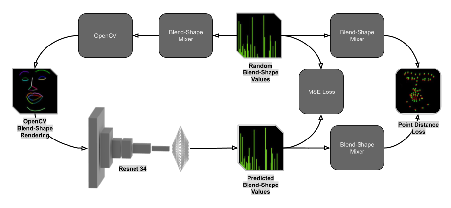
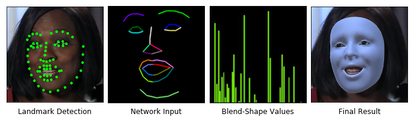
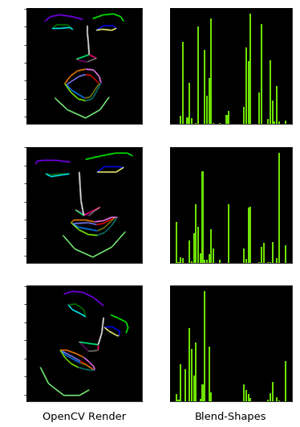

# Facial-Pose-Estimation-Pytorch-v2
Training a Neural Net in Pytorch to generate 3d facial pose estimation from only facial landmarks.

## About
This is one of three repositories which together form a larger project, these are the three repositories:
- [facial-pose-estimation-pytorc-v2](https://github.com/NeuralVFX/facial-pose-estimation-pytorch-v2) - You are here.
- [facial-pose-estimation-libtorch](https://github.com/NeuralVFX/facial-pose-estimation-libtorch)
- [facial-pose-estimation-libtorch-unreal](https://github.com/NeuralVFX/facial-pose-estimation-libtorch-unreal)

This blog post describes the whole project: [AR Facial Pose Estimation](http://neuralvfx.com/augmented-reality/ar-facial-pose-estimation/)

## Extra Info
- Main code is in [Jupyter Notebook](face_pose_net.ipynb)
- Training data is artificially generated on the fly using OpenCV
- Output is 51 blend-shape float values which can be applied to a face mesh
- This only outputs blend-shape values, head transform is handled by a separate part of the pipeline

## Training Pipeline Example

## Inference Pipeline Example

## Artificial Data-Pair Examples

## Code Usage
Usage instructions found here: [user manual page](USAGE.md).

